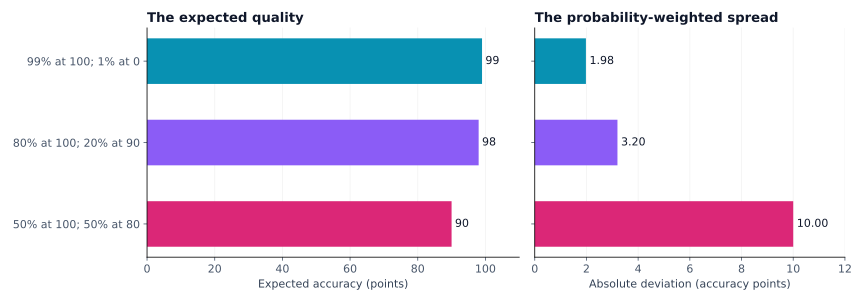
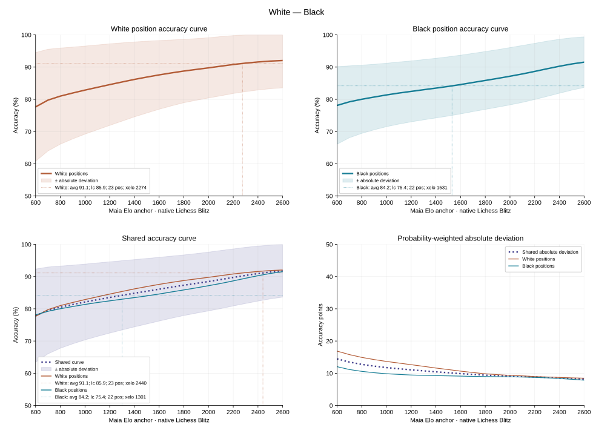
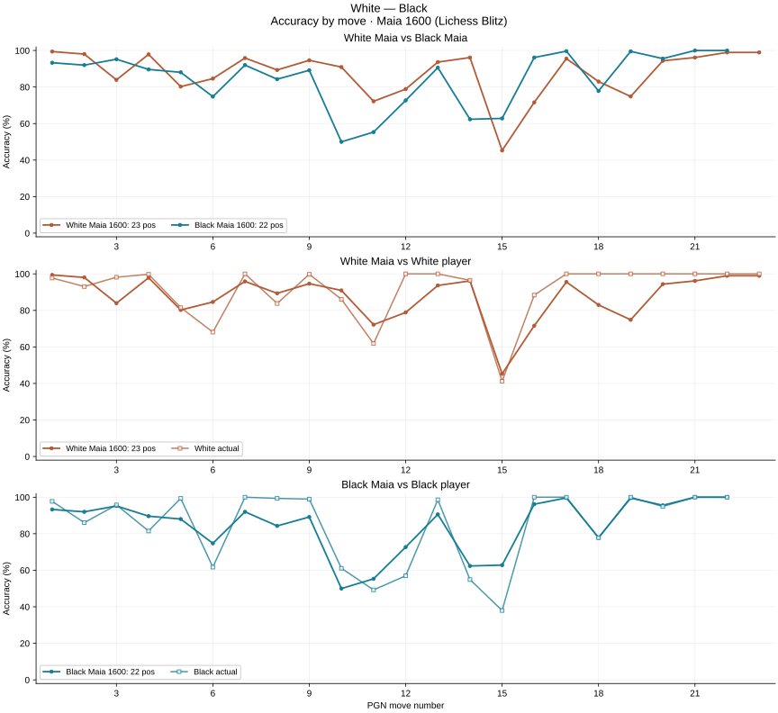

# Accuracy Curves for Human-Centered Chess Analysis

## Abstract

A chess game's accuracy is easier to interpret when compared with human move choices in the positions that actually occurred. This paper presents a family of accuracy curves derived from rating-conditioned Maia policies and engine-derived move qualities. Rating-axis curves summarize expected accuracy and probability-weighted absolute deviation for each side and their shared position sample. Move-axis curves compare a fixed Maia policy with both sides' actual decisions over the game's chronology. The views share the same position-level measurements; Lichess game accuracy remains a separate aggregation. The construction uses all legal moves, excludes forced choices from the arithmetic comparison, and remains within Maia's native Lichess Blitz range of 600–2600. Its purpose is descriptive evidence for chess analysis; it does not estimate player ratings or assign probability coverage to deviation bands.

## 1. Motivation and scope

A high arithmetic accuracy can arise from many straightforward decisions, a short forcing sequence, or difficult choices solved well. The same number therefore has different meanings in different games. A rating-conditioned human policy supplies a local reference: which legal moves would be likely at a stated Maia level in these particular positions? Maia-3 models such move choices with separate player and opponent rating inputs. Here both inputs are set to the same rating to obtain comparable reference policies across the native range. [Maia-3 model description](https://github.com/CSSLab/maia3/blob/main/README.md)

Expected accuracy summarizes those policies, but does not describe their spread. Squared deviations can make a rare, very poor alternative dominate a variance. Absolute deviation retains its probability while measuring distance linearly in accuracy points. Keeping the expectation and deviation as separate curves makes both ordinary decision quality and rare errors visible without reducing the game to a fitted strength number.

All calculations below condition on the positions and histories of one observed game. They do not simulate alternative complete games or use other games to calibrate a curve. The rating-axis view asks how expected quality changes across human policy levels on a fixed position sample. The move-axis view asks where a selected policy encounters low expected quality, and where the player's actual choices differ from that expectation. These are complementary projections of one set of measurements.

## 2. Position-level measurements

Let \(i\) index a played position, \(\mathcal M_i\) its legal moves, and \(m_i^\star\) the actual move. At each native Lichess Blitz anchor

\[
\mathcal R=\{600,700,\ldots,2600\},
\]

let \(p_{i,r}(m)\) be Maia's legal-move probability conditioned on the full available game history and the pair of ratings \((r,r)\). Probabilities are normalized over the complete legal set:

\[
p_{i,r}(m)\geq0,\qquad \sum_{m\in\mathcal M_i}p_{i,r}(m)=1.
\]

No top-move cutoff or probability-mass truncation is applied. Let \(q_i(m)\in[0,100]\) be the accuracy assigned to move \(m\), measured from the mover's perspective.

### 2.1 Engine scores and move accuracy

For an engine centipawn score \(c\), the winning-percentage transform is \(w(c)=100/(1+\exp(-0.00368208c))\). Scores are bounded to \([-1000,1000]\) for this transform; signed mate scores use the corresponding endpoint. Change White-relative winning percentage into mover-relative percentage before comparing moves. Given the before and after values \(b,a\), move accuracy is 100 when \(a\geq b\); otherwise,

\[
q(b,a)=\operatorname{clip}_{[0,100]}
\left(103.1668100711649e^{-0.04354415386753951(b-a)}
-3.166924740191411+1\right).
\]

This follows the Lichess implementation's numeric convention. Accuracy is a transformed evaluation loss, not an empirical probability that a move is correct. [Lichess move-accuracy implementation](https://github.com/lichess-org/lila/blob/f4da67dc45bba6769600db33af925c05ae21a8d0/modules/analyse/src/main/AccuracyPercent.scala)

The observed move uses the next unrestricted position evaluation, or its played-move evaluation at the end of the sequence. Other legal moves use their root-search evaluations. The standard initial position starts from the Lichess convention of +15 centipawns; a custom start uses its measured evaluation. Checkmate and automatic terminal draws take precedence over search scores. This alignment keeps the observed move compatible with the played-game metric, although unequal search effort across alternatives remains a source of measurement error.

### 2.2 Expected accuracy and absolute deviation

The policy expectation at a position is

\[
\mu_i(r)=\sum_{m\in\mathcal M_i}p_{i,r}(m)q_i(m).
\]

Its probability-weighted absolute deviation about that expectation is

\[
d_i(r)=\sum_{m\in\mathcal M_i}
p_{i,r}(m)\left|q_i(m)-\mu_i(r)\right|.
\]

The center is the probability-weighted mean, not the median, and the quantity is an average absolute deviation rather than a median absolute deviation. Both \(\mu_i\) and \(d_i\) are in accuracy points. Moving a low-probability outcome farther from the center increases its direct contribution linearly with distance. The center also changes when probabilities or qualities change, so the metric does not discard rare poor moves.

For a two-outcome position with accuracy 100 at probability \(1-\varepsilon\) and accuracy 0 at probability \(\varepsilon\),

\[
\mu=100(1-\varepsilon),\qquad
d=200\varepsilon(1-\varepsilon).
\]

At \(\varepsilon=0.01\), the expectation is 99 and the deviation is 1.98 points. Variance would instead be 99 squared points. These are different units and answer different questions.

| Synthetic quality distribution | Expected accuracy | Absolute deviation |
| --- | ---: | ---: |
| 99% at 100; 1% at 0 | 99 | 1.98 |
| 80% at 100; 20% at 90 | 98 | 3.20 |
| 50% at 100; 50% at 80 | 90 | 10.00 |



*Figure 1. Each bar is the sum of probability-weighted absolute distances about its distribution's mean. A rare catastrophic alternative contributes less typical spread than a frequent moderate alternative, while remaining represented.*

For any random quality \(Q\in[0,100]\) with mean \(\mu\), convexity bounds its absolute distance by the chord connecting the endpoints:

\[
\mathbb E|Q-\mu|
\leq \frac{2\mu(100-\mu)}{100}\leq50.
\]

Thus deviation is bounded between 0 and 50. It is zero when every positive-probability move has the same quality, even if several different moves are possible.

## 3. A common reference for both players

Let \(I_s\) be the positions played by side \(s\) that have more than one legal move, and \(n_s=|I_s|\). Forced positions are excluded from the arithmetic comparison because choosing their sole legal move supplies no evidence about decision quality. For each nonempty side define

\[
C_s(r)=\frac{1}{n_s}\sum_{i\in I_s}\mu_i(r),\qquad
D_s(r)=\frac{1}{n_s}\sum_{i\in I_s}d_i(r),\qquad
A_s=\frac{1}{n_s}\sum_{i\in I_s}q_i(m_i^\star).
\]

Here \(A_s\) is the player's observed arithmetic average accuracy. If \(S\) contains the sides with at least one eligible position, the shared measurements are

\[
C(r)=\frac{1}{|S|}\sum_{s\in S}C_s(r),\qquad
D(r)=\frac{1}{|S|}\sum_{s\in S}D_s(r).
\]

Equal-side pooling prevents the side with more eligible moves from dominating the common reference. Each eligible position still receives equal weight within its own side. A single nonempty side defines the available curve; with no eligible positions the arithmetic metrics remain unavailable rather than becoming zero.

Crucially, \(D(r)\) averages deviations around each position's own expectation. It is not the absolute deviation of a mixture around the pooled expectation, which would also include differences in positional difficulty. It is not a standard error of \(C(r)\), and no division by \(\sqrt{n_s}\) or \(n_s^2\) is applied. This descriptive calculation needs no assumption that decisions at different plies are independent.

The accuracy figure separates the expectations into a 2×2 grid. The top-left panel compares White's observed average with \(C_{\mathrm W}(r)\); the top-right compares Black's with \(C_{\mathrm B}(r)\). The bottom-left compares both observations with the shared \(C(r)\), overlaying both side curves to expose differences in their position sets. Only the shared deviation band is shaded in this combined panel. The bottom-right shows \(D_{\mathrm W}(r)\), \(D_{\mathrm B}(r)\) and \(D(r)\). Compact player legends use \(\texttt{avg}\) for arithmetic accuracy, \(\texttt{lc}\) for Lichess game accuracy, \(\texttt{pos}\) for eligible decisions and \(\texttt{xelo}\) for an existing intersection coordinate. Accuracy values are displayed to one decimal; only arithmetic accuracy sets the horizontal comparison line. The side curves retain the different decision contexts faced by the players; the shared curve gives both observations one common reference. Measured native anchors are connected directly. No monotonic regression, extrapolation or smooth tail changes the measurements. Local decreases can reflect the conditional policy or engine evidence and should remain inspectable.

For side \(s\), intersections solve either \(C_s(r)=A_s\), comparing its choices with policies on its own positions, or \(C(r)=A_s\), comparing with the common reference. Write \(F\) for the selected curve, \(C_s\) or \(C\). Between adjacent anchors with different expected accuracies, the intersection coordinate is

\[
r_\times=r_k+\frac{A_s-F(r_k)}{F(r_{k+1})-F(r_k)}(r_{k+1}-r_k),
\]

provided \(A_s\) lies between the two measured values. Intersection coordinates are included in the player legend labels beside the accuracy statistics: own-curve crossings in the top panels and shared-curve crossings in the combined panel. Thin, faint dotted horizontal and vertical guides locate crossings without additional point markers or text over the curves. Every distinct crossing is retained; a flat segment equal to \(A_s\) is reported as an overlap range in the legend. If there is no crossing within 600–2600, the observed average remains visible without an intersection coordinate; no crossing is extrapolated. These coordinates identify where an expected policy accuracy equals the observed average on the selected position set. They are geometric comparisons, not estimates of player rating or playing strength.

### 3.1 Worked example: a short English Opening game

The following game was played on Chess.com at 15 minutes plus a 10-second increment. The supplied account ratings were 1229 for White and 1211 for Black, both on the Chess.com Rapid scale. They identify the players' context; neither rating enters the accuracy curve calculation. Its horizontal axis remains Maia's native Lichess Blitz conditioning scale.

```pgn
[Site "Chess.com"]
[WhiteElo "1229"]
[BlackElo "1211"]
[TimeControl "900+10"]
[Result "1-0"]

1. c4 e5 2. e3 d5 3. cxd5 Qxd5 4. Nc3 Qa5 5. a3 c6
6. b4 Qc7 7. Nf3 Bd6 8. Qc2 Nf6 9. Bb2 O-O 10. Rc1 Re8
11. Be2 e4 12. Ng5 h6 13. Ngxe4 Nxe4 14. Nxe4 Bf5 15. Bd3 Bxh2
16. g3 Bxe4 17. Bxe4 Bxg3 18. fxg3 Qxg3+ 19. Ke2 Qg4+
20. Bf3 Qe6 21. Rcg1 g6 22. Rxh6 Nd7 23. Rh8# 1-0
```


All 45 played positions have more than one legal move, so the arithmetic sample contains 23 White decisions and 22 Black decisions. Each side receives half of the shared curve's weight despite these unequal counts.

| Side | Actual Chess.com Rapid rating | Eligible decisions | Arithmetic accuracy | Lichess game accuracy |
| --- | ---: | ---: | ---: | ---: |
| White | 1229 | 23 | 91.13% | 85.86% |
| Black | 1211 | 22 | 84.19% | 75.41% |

The same legal-move qualities are reweighted by each native Maia policy. Selected anchor values illustrate the resulting game-specific reference:

| Native Maia anchor | Shared expected accuracy \(C(r)\) | Absolute deviation \(D(r)\), points |
| ---: | ---: | ---: |
| 600 | 77.88% | 14.46 |
| 1000 | 82.11% | 11.76 |
| 1400 | 84.83% | 10.44 |
| 1800 | 87.32% | 9.40 |
| 2200 | 89.73% | 8.85 |
| 2600 | 91.79% | 8.17 |

For example, at the 1600 anchor the two position sets give

\[
C(1600)=\frac{87.5814+84.5880}{2}=86.0847,\qquad
D(1600)=\frac{10.6584+9.1154}{2}=9.8869.
\]

White's observed arithmetic accuracy exceeds this anchor's expected quality, while Black's is below it. These are comparisons of choices in the observed positions, not player-rating estimates. The larger Lichess-to-arithmetic difference for Black reflects the different aggregation of the played inaccuracies; neither Lichess value is used to locate a point on the arithmetic curve.



*Figure 2. Accuracy curves for the complete game above, using its stored engine evaluations and all legal Maia move probabilities. Top-left: White's position curve and observed arithmetic accuracy. Top-right: the corresponding Black comparison. Bottom-left: the shared curve, both side curves and both arithmetic averages. Bottom-right: White and Black absolute-deviation profiles and their equal-weight average. White curves are warm brown and Black curves cool teal; side curves are solid and shared curves dotted. Native Elo ticks are spaced by 200, and the deviation panel uses the full 0–50-point scale. Compact player legends record accuracy statistics and intersection coordinates; thin, faint dotted horizontal and vertical guides locate own-curve crossings above and shared-curve crossings below. Top panels shade their respective side's expectation plus or minus mean absolute deviation; the combined panel shades only the shared band. Bands are clipped to the accuracy domain, with no claimed probability coverage or extrapolation.*

## 4. Accuracy by move

Fix a native Maia anchor \(r_0\), for example 1600, and retain the game's chronology instead of averaging its positions. Let \(i_s(t)\) denote side \(s\)'s recorded decision at PGN fullmove number \(t\). For each non-forced decision, define

\[
E_s(t;r_0)=\mu_{i_s(t)}(r_0),\qquad
O_s(t)=q_{i_s(t)}(m_{i_s(t)}^\star),\qquad
\Delta_s(t;r_0)=O_s(t)-E_s(t;r_0).
\]

\(E_s\) is the policy's probability-weighted expected accuracy in that particular position; \(O_s\) is the actual move's accuracy. Neither is a cumulative average. The difference \(\Delta_s\), measured in accuracy points, states whether that one choice exceeded or fell below the selected policy's expectation. It is not a standardized residual or a statistical significance score. The position's \(d_{i_s(t)}(r_0)\) remains available as descriptive context, without turning it into an error bar or dividing the difference by it.

Three aligned panels separate the relevant comparisons:

| Panel | Curves | Question answered |
| --- | --- | --- |
| White Maia versus Black Maia | \(E_{\mathrm W}(t;r_0)\), \(E_{\mathrm B}(t;r_0)\) | On which side's reached positions does the same policy yield lower expected accuracy? |
| White Maia versus White actual | \(E_{\mathrm W}(t;r_0)\), \(O_{\mathrm W}(t)\) | Where do White's choices exceed or fall below their position-specific reference? |
| Black Maia versus Black actual | \(E_{\mathrm B}(t;r_0)\), \(O_{\mathrm B}(t)\) | Where do Black's choices exceed or fall below their position-specific reference? |

One PGN move number contains two distinct decision contexts: White chooses before White's move, and Black chooses after it. Points at the same \(t\) therefore share chronology, not a common board position. The two accuracies are never averaged into a single move value. Custom starting move numbers and games beginning with Black to move retain their PGN numbering.

A single-legal-move position contributes no point for the affected side, just as it contributes no arithmetic observation. If omission creates a gap between retained points, a dotted connector spans the gap without inserting an accuracy measurement. Ordinary adjacent points are joined by solid lines. The other side retains its own eligible decision at that move number. A final unpaired White move is shown only for White. Line segments guide the eye; they do not measure intermediate positions.

The move-axis and rating-axis views agree algebraically. For the eligible move numbers \(T_s\),

\[
C_s(r_0)=\frac{1}{n_s}\sum_{t\in T_s}E_s(t;r_0),\qquad
A_s=\frac{1}{n_s}\sum_{t\in T_s}O_s(t),\qquad
A_s-C_s(r_0)=\frac{1}{n_s}\sum_{t\in T_s}\Delta_s(t;r_0).
\]

Thus the game-average gap is exactly the average of its position-level gaps. The chronology reveals whether that average reflects many modest differences or a few large ones; it cannot establish their chess explanation by itself.

### 4.1 Worked example at Maia 1600

For the same English Opening game, selected observations are:

| Decision | Maia expectation \(E_s\) | Actual accuracy \(O_s\) | Actual minus expected \(\Delta_s\), points |
| --- | ---: | ---: | ---: |
| 12. Ng5 | 78.87% | 100.00% | +21.13 |
| 12...h6 | 72.69% | 56.98% | −15.70 |
| 15. Bd3 | 45.27% | 41.21% | −4.06 |
| 15...Bxh2 | 62.83% | 37.97% | −24.86 |

At move 12, White's choice exceeds its Maia reference while Black's falls below its separate reference. Both played moves at move 15 have low accuracy, but White's is much closer to its policy expectation than Black's. This distinction would be lost by considering only actual accuracy or only the game average. The values identify positions for investigation; explanations of tactics, plans or practical difficulty require examining the legal alternatives and their continuations.



*Figure 3. The same game's position-level measurements at the native Maia 1600 anchor. The top panel compares both policy expectations; the middle and bottom panels compare each expectation with that side's actual choices. Warm curves denote White and cool curves Black. Filled circles identify expectations; lighter solid lines with hollow squares identify actual moves. The horizontal axis is PGN fullmove number, and small vertical margins keep values at 0 and 100 visible. This game has no omitted forced decisions; in games that do, only gaps across those omitted turns use dotted connectors.*

## 5. Arithmetic and Lichess game accuracy

Arithmetic accuracy answers an equal-position question over non-forced choices and is directly comparable to the arithmetic shared curve. Lichess game accuracy combines a volatility-weighted mean \(V_s\) with a harmonic mean \(H_s\):

\[
V_s=\frac{\sum_j\omega_j a_j}{\sum_j\omega_j},\qquad
H_s=\frac{N_s}{\sum_j1/\max(1,a_j)},\qquad
L_s=\frac{V_s+H_s}{2}.
\]

Here \(a_j\) is an observed move accuracy, and \(\omega_j\) is the local winning-percentage standard deviation clipped to \([0.5,12]\). The window width is \(\operatorname{clip}_{[2,8]}(\lfloor N/10\rfloor)\) for \(N\) total played plies, with upstream window alignment. Missing evaluations retain their sequence positions; forced moves are not removed by the shared-curve exclusion rule. [Lichess game-accuracy implementation](https://github.com/lichess-org/lila/blob/f4da67dc45bba6769600db33af925c05ae21a8d0/modules/analyse/src/main/AccuracyPercent.scala)

The harmonic component emphasizes weak moves, while volatility weighting changes the influence of different phases of the evaluation sequence. This is why \(L_s\) generally differs from \(A_s\); comparing Lichess accuracy directly to \(C(r)\) would mix incompatible aggregations. The two values are reported separately. [Lichess explanation of game accuracy](https://lichess.org/page/accuracy)

## 6. Interpretation and limitations

The native Elo coordinate specifies a Maia policy, not an estimated rating for the player. An observed arithmetic average above the measured curve means the actual choices exceeded that policy's expected quality on this game's position sample. It does not establish play above 2600. Easy positions, a short sample, policy mismatch and selected continuations can all produce such an observation.

The deviation curve describes dispersion under each conditional Maia policy. A narrow band neither certifies Maia's prediction accuracy nor bounds error in engine evaluation or player ability. It also does not quantify the chance of a rare tactical collapse; individual move probabilities and verified continuations remain necessary for that question.

White and Black reached different decision contexts. Their separate curves make these differences visible, while equal pooling supplies a common reference without proving that equal accuracy implies equal difficulty. Lower expected accuracy is evidence of lower expected move quality under the selected policy, not a direct measurement of human effort. An actual move can exceed the policy mean without being objectively best. Conversely, accuracy near 100 can occur when legal alternatives have similarly poor outcomes in an already lost position; accuracy measures deterioration, not the absolute desirability of the position. Moreover, policies sampled independently at recorded positions are not a coherent counterfactual game: choosing an alternative earlier would change later positions.

For coaching, these summaries direct attention rather than decide praise or criticism. Human-likely continuations, stronger Maia choices, practical counterplay and legal tactical checks are needed to explain the ideas behind decisions. Expected accuracy, absolute deviation, arithmetic accuracy and Lichess accuracy provide complementary evidence while leaving those chess explanations explicit.
