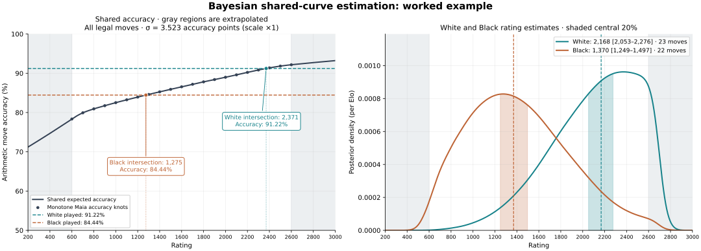
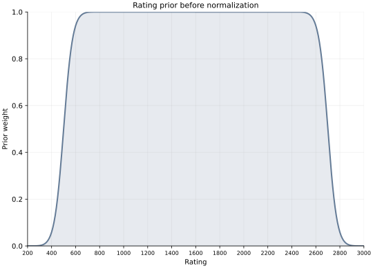

# Bayesian Shared-Curve Estimation of Single-Game Playing Strength

## Abstract

Single-game playing strength can be summarized by comparing observed move quality with a rating-conditioned model of human move selection. This paper defines a shared-curve estimator using Maia's probabilities over all legal moves and Stockfish-derived move accuracies. At each position and rating, move accuracies are weighted by the complete normalized policy. Their expected accuracies are pooled across both players and constrained not to decrease with rating. Smooth exponential tails extend the reference curve over 0–3200 beyond observed Maia ratings; a common prior is flat over 800–2400 and has fourth-power shoulders that reach zero at 200 and 3000. A Gaussian working likelihood compares played accuracy with the curve, using a common standard deviation derived from the complete move distributions without rescaling. The posterior median and central 20% interval preserve within-game ordering by arithmetic move accuracy. A 45-ply worked example illustrates the calculation. These outputs describe a conditional performance model, not established prediction accuracy or a player's long-run Elo.

## 1. Objective and design

The estimand is **playing strength in the observed game, expressed on the Maia rating scale**. The inputs are the played move sequence, engine evaluations of legal alternatives, and Maia's rating-conditioned probabilities. Maia supplies a model of human move selection; Stockfish supplies the move-quality measurement. Maia-3 is the human-move model used in the example [1].

Three design choices determine the estimator. First, its reference curve weights every legal move by Maia's probability, incorporating both likely decisions and rare errors without selecting moves by engine quality. A player need not match Maia's most probable move to receive a high score. Second, both players use the same game-specific reference curve, ensuring that their scores are interpreted on a common scale. Third, account ratings do not enter the fitting equations or prior. Holding numerical evidence fixed, changing those ratings leaves the estimates unchanged.

Equal-side pooling intentionally trades some side-specific difficulty adjustment for comparability. The working likelihood conditions on the observed positions and an estimated curve, with error measured in accuracy percentage points. It does not model the probability of an entire alternative game. The rating ranges serve distinct purposes: $[\ell,u]=[600,2600]$ contains Maia evidence, $[a,b]=[0,3200]$ is the curve-extension and numerical grid range, and $[a_p,b_p]=[200,3000]$ bounds the nonzero prior and posterior. The prior has a flat plateau over $[\ell_p,u_p]=[800,2400]$ and smooth shoulders on either side. It therefore permits inference beyond the measured range while excluding the outermost extrapolated ratings. These limits and the noise scale are explicit modeling assumptions, rather than demonstrated limits on human strength or single-game estimation error.

## 2. Evidence and move quality

Let $s\in\{W,B\}$ identify the player, $i=1,\ldots,n_s$ a decision, $\mathcal L_{si}$ its legal-move set, and $a_{si}$ the played move. At $K=21$ rating knots $r_k=600+100k$, $k=0,\ldots,20$, obtain

$$
p_{si,k}(m)=\Pr_{\mathrm{Maia}}
\left(m\mid x_{si},h_{si},\text{own rating}=r_k,
                         \text{opponent rating}=r_k\right),
\qquad m\in\mathcal L_{si},
$$

where $x_{si}$ and $h_{si}$ are the actual position and its history. Each initial policy covers every legal move and sums to one. Equal own/opponent conditioning provides a consistent rating benchmark. Positions with exactly one legal move are excluded from both observed and expected averages: they offer no choice. The index $i$ and count $n_s$ refer only to the remaining decisions. A position where one move has high Maia probability remains included when other legal moves exist.

Move quality uses the Lichess accuracy transformation with its one-point analysis-uncertainty adjustment [2]. For a White-relative centipawn evaluation $c$, define the evaluation-to-percentage mapping

$$
w(c)=\frac{100}{1+\exp[-0.00368208\,\operatorname{clip}(c,-1000,1000)]}.
$$

Mate evaluations map to signed 1000 centipawns; terminal draws map to zero. The mover-relative evaluation percentage is $w(c)$ for White and $100-w(c)$ for Black. If this percentage decreases by $d$ points after a candidate move, its accuracy is

$$
q(d)=
\begin{cases}
100, & d\leq0,\\
\operatorname{clip}_{[0,100]}
\left(103.1668100711649e^{-0.04354415386753951d}
      -2.166924740191411\right), & d>0.
\end{cases}
$$

Denote the resulting quality by $q_{si}(m)$. This is an engine-derived score; the winning-percentage transform is not independently calibrated for this model.

Each candidate is measured against the evaluation of the position before the decision, using the same mover's perspective throughout. The played move's quality uses the evaluation of the resulting position; alternative qualities use searches constrained to their respective candidate moves. Terminal outcomes are resolved explicitly. Finite searches can assign different qualities to the same continuation at different search depths, so complete legal coverage alone does not eliminate measurement error.

The estimator averages these **per-move** accuracies arithmetically. This statistic differs from Lichess's aggregate game accuracy, which combines volatility weighting and a harmonic mean [2].

## 3. Estimation method

### 3.1 Probability-weighted player moments

At each position and rating, retain every legal move and its normalized Maia probability. The expected accuracy and variance are

$$
\mu_{si}(r_k)=\sum_{m\in\mathcal L_{si}}p_{si,k}(m)q_{si}(m),
\qquad
v_{si}(r_k)=\sum_m p_{si,k}(m)q_{si}(m)^2-\mu_{si}(r_k)^2.
$$

Rare moves retain their probability-weighted contribution; moves with zero model probability contribute zero. There is no probability cutoff or engine-quality selection. The full legal policy supplies both moments.

For each player, calculate the observed average, expected average, and approximate variance of the average:

$$
A_s=\frac{1}{n_s}\sum_i q_{si}(a_{si}),\qquad
M_s(r_k)=\frac{1}{n_s}\sum_i\mu_{si}(r_k),\qquad
V_s(r_k)=\frac{1}{n_s^2}\sum_i v_{si}(r_k).
$$

The observed average includes the actual played move irrespective of its Maia probability. The reference $M_s$ is the expected arithmetic accuracy under the complete policies at the observed positions; it is not an expectation over complete alternative game trajectories. The expression for $V_s$ treats decisions as independent conditional on the fixed positions. It describes the variance of an average; no additional division by $n_s$ is applied. Observed and reference averages use the same positions and equal weights. Small negative variances caused by floating-point cancellation are set to zero.

### 3.2 Shared monotone reference curve

Pool the two expected-accuracy curves with equal weight:

$$
C_k^0=\frac{M_W(r_k)+M_B(r_k)}{2}.
$$

Each player contributes one half, regardless of move count. To express the assumption that expected accuracy should not decrease with rating, project the measured knots onto the nondecreasing sequences:

$$
(\widehat C_0,\ldots,\widehat C_{20})
=\underset{z_0\leq\cdots\leq z_{20}}{\arg\min}
  \sum_{k=0}^{20}(z_k-C_k^0)^2.
$$

Equal-weight isotonic regression solves this least-squares problem using the pool-adjacent-violators algorithm [3]. A shape-preserving piecewise cubic Hermite interpolant (PCHIP) defines $C(r)$ between knots while preserving monotonicity [4]. Projection corrects local reversals in the estimated accuracy curve without imposing a global linear or logistic relationship between rating and accuracy.

### 3.3 Smooth bounded extrapolation

Let $c_\ell=C(\ell)$, $c_u=C(u)$, and let $s_\ell=C'(\ell)\geq0$ and $s_u=C'(u)\geq0$ be the interpolant's one-sided endpoint slopes. Extend the shared curve to the numerical range $[a,b]=[0,3200]$ by

$$
\widetilde C(r)=
\begin{cases}
c_\ell\exp\!\left[\dfrac{s_\ell(r-\ell)}{c_\ell}\right], & a\leq r<\ell,\\[6pt]
C(r), & \ell\leq r\leq u,\\[4pt]
100-(100-c_u)\exp\!\left[-\dfrac{s_u(r-u)}{100-c_u}\right], & u<r\leq b.
\end{cases}
$$

For endpoint accuracies strictly between 0 and 100, the tails match both values and first derivatives, preserve monotonicity, and remain in $[0,100]$. A zero endpoint slope gives a constant tail. When $c_\ell=0$, the lower tail is identically zero; when $c_u=100$, the upper tail is identically 100. These saturated cases preserve continuity and the accuracy bounds, but derivative continuity additionally requires the corresponding slope to be zero. Clipping to $[0,100]$ also guards against numerical roundoff. The finite curve-extension endpoints are not forced to have accuracy zero or 100: those are asymptotic limits for tails with positive slopes, not additional observations at ratings 0 and 3200.

This extension retains every measured knot and the entire in-range interpolant. It supplies a smooth continuation without fitting extra tail parameters to game outcomes, account ratings, or external performance labels. The values outside $[600,2600]$ are extrapolations; no additional Maia evidence supports them.

### 3.4 Gaussian accuracy likelihood

Average the conditional mean variances over both players and all measured rating knots:

$$
\overline V=\frac{1}{2K}\sum_{s\in\{W,B\}}\sum_{k=0}^{K-1}V_s(r_k).
$$

Use a common effective accuracy standard deviation $\sigma=\kappa\sqrt{\overline V}$, with $\kappa=1$, and define the Gaussian working likelihood

$$
L_s(r)=\exp\!\left[-\frac{(A_s-\widetilde C(r))^2}{2\sigma^2}\right],
\qquad \sigma^2=\kappa^2\overline V.
$$

The default $\kappa=1$ uses the calculated standard deviation directly. A different positive multiplier would change likelihood concentration without adding observations; it is a modeling choice, not a derivation from the Elo expected-score formula or a guarantee of interval coverage. The variance calculation is game-dependent and uses the same complete policies as the reference curve. With comparable move variances, its standard deviation decreases approximately as the inverse square root of game length.

The common variance keeps both players on the same likelihood scale and preserves the ordering property below. It remains constant across rating hypotheses within a game. A positive numerical floor handles an otherwise zero variance. Neither a fixed rating width nor a hard distance cutoff is imposed: the curve's local slope, its shape, and the prior determine the resulting rating uncertainty. An observed accuracy outside the curve's range is evaluated through the same residual formula; it is not replaced with an endpoint rating.

### 3.5 Tapered prior and posterior

Use a common prior with a flat interior and symmetric fourth-power shoulders. Its plateau $[\ell_p,u_p]=[800,2400]$ is distinct from the measured Maia range $[\ell,u]=[600,2600]$. Let $L_-=\ell_p-a_p$ and $L_+=b_p-u_p$ be the shoulder lengths, with $[a_p,b_p]=[200,3000]$. Define a smooth ramp on $[0,1]$ by

$$
S(t)=\frac{t^4}{t^4+(1-t)^4}.
$$

The unnormalized prior weight is

$$
g(r)=
\begin{cases}
S\!\left(\dfrac{r-a_p}{L_-}\right), & a_p<r<\ell_p,\\[6pt]
1, & \ell_p\leq r\leq u_p,\\[4pt]
S\!\left(\dfrac{b_p-r}{L_+}\right), & u_p<r<b_p,\\[6pt]
0, & \text{otherwise}.
\end{cases}
$$

The identity $S(t)+S(1-t)=1$ gives $\int_0^1 S(t)\,dt=1/2$, so each shoulder has integral equal to half its width. The prior density is $p(r)=g(r)/Z_p$, with

$$
Z_p=(u_p-\ell_p)+\frac{L_-+L_+}{2}=2200.
$$

The raw weight is exactly 1 throughout 800–2400 and zero below 200 and above 3000, including the grid endpoints 0 and 3200. On the lower shoulder, its values at ratings 400, 500 and 600 are $1/17$, $1/2$ and $16/17$; the upper shoulder mirrors these weights at 2800, 2700 and 2600. The fourth power creates slow changes near weights zero and one, with a faster transition in the middle of each shoulder. Values and the first three derivatives join continuously at the plateau and support boundaries. This prior treats ratings within the plateau equally while gradually downweighting the edges of the measured range and the extrapolated region. Neither player's account rating changes it. These are weights before normalization: dividing by $Z_p$ produces the probability density used in inference.

Combine the Gaussian likelihood with the common prior:

$$
\pi_s(r)=
\frac{g(r)L_s(r)}
     {\displaystyle\int_{a_p}^{b_p}
       g(t)L_s(t)\,dt},
\qquad a_p\leq r\leq b_p.
$$

The finite support ensures a proper posterior; tapering suppresses probability near its endpoints. Changing only the density at two isolated endpoints would have no effect on posterior probabilities. The shoulders matter because they change the prior over intervals of positive width.

### 3.6 Point estimate and displayed interval

The estimate is the posterior median $\widehat r_s=F_s^{-1}(0.5)$, which minimizes posterior expected absolute error. A central interval containing posterior probability $\alpha$ is

$$
I_s(\alpha)=
\left[F_s^{-1}\!\left(\frac{1-\alpha}{2}\right),
      F_s^{-1}\!\left(\frac{1+\alpha}{2}\right)\right].
$$

The displayed range uses $\alpha=0.20$, corresponding to the 40th and 60th percentiles. It deliberately shows only the central fifth of posterior probability; 40% lies on each side. Its smaller width does not indicate increased information, improved accuracy, or 68% or 90% coverage. Changing $\alpha$ changes the interval but not the median or posterior distribution.

The shared curve and stabilized posterior densities are evaluated on a five-rating-point grid over $[0,3200]$. Integration uses the trapezoidal rule with interpolated quantiles. Curve intersections shown in the figures use linear interpolation between sampled curve values and are diagnostic markers, not the centers of a separate rating likelihood. Medians are rounded to the nearest integer and interval bounds outward. Grid spacing is computational resolution, not estimation precision.

## 4. Properties and interpretation

**Within-game ordering.** For two observed accuracies $A_2>A_1$, with the curve, common variance, and prior fixed, their posterior log ratio is

$$
\log\frac{\pi(r\mid A_2)}{\pi(r\mid A_1)}
=\frac{(A_2-A_1)\widetilde C(r)}{\sigma^2}+\text{constant}.
$$

The common prior cancels wherever its density is positive. Because $\widetilde C$ is nondecreasing, the likelihood ratio is also nondecreasing, so higher arithmetic accuracy cannot yield a lower posterior median. Rounded medians can tie. Above-curve observations retain their different residuals and are not forced to have identical posteriors. This ordering property does not establish long-run strength or compare players evaluated against different games' curves. Swapping the players swaps their estimates and leaves the common curve unchanged.

**Resolution and sensitivity.** Near a unique intersection $r_s^*$ with positive slope, a first-order expansion gives a local Gaussian rating scale $\sigma_r\approx\sigma/\widetilde C'(r_s^*)$. This approximation requires a nearly linear curve over the relevant region and negligible prior variation. A smaller accuracy sigma narrows the likelihood, but does not guarantee a particular rating interval when the curve is shallow or the posterior is near a boundary. A perturbation of accuracy shifts the intersection by approximately $\Delta r_s^*=\Delta A_s/\widetilde C'(r_s^*)$. Nonlinear curve shape and prior tapering can make the posterior asymmetric and move its median away from the intersection.

**Identifiability and boundary behavior.** A constant reference curve contains no rating distinction, so its point estimates are withheld. Any plateau produces a constant likelihood over that segment; the method does not insert an artificial midpoint peak. If observations exist for only one player, that player's moments define the curve and common variance, while the unobserved player has no estimate. An above-curve accuracy makes the likelihood increase toward the upper support boundary, while a below-curve accuracy makes it decrease. The prior suppresses both extremes and can substantially affect the resulting median. These estimates remain conditional on extrapolation and the chosen support, rather than on a supported curve intersection.

## 5. Worked example: a 23-move game

Consider the following game between players with recorded ratings of 1600 and 1585. These ratings describe the players and do not enter the fitting equations.

```pgn
[WhiteElo "1600"]
[BlackElo "1585"]
[Result "1-0"]

1. c4 e5 2. e3 d5 3. cxd5 Qxd5 4. Nc3 Qa5 5. a3 c6 6. b4 Qc7
7. Nf3 Bd6 8. Qc2 Nf6 9. Bb2 O-O 10. Rc1 Re8 11. Be2 e4
12. Ng5 h6 13. Ngxe4 Nxe4 14. Nxe4 Bf5 15. Bd3 Bxh2 16. g3 Bxe4
17. Bxe4 Bxg3 18. fxg3 Qxg3+ 19. Ke2 Qg4+ 20. Bf3 Qe6
21. Rcg1 g6 22. Rxh6 Nd7 23. Rh8# 1-0
```

There are 45 decisions: $n_W=23$ and $n_B=22$. None has exactly one legal move, so all remain included. The example uses Maia-3 79M move probabilities and Stockfish searches with a depth ceiling of 18 and a nominal 12-second budget per position. Both Maia rating inputs range together from 600 to 2600. The standard initial position is assigned a baseline evaluation of $+15$ centipawns. The following calculations apply the method above to the resulting move-quality scores and probability distributions.

### 5.1 One position: from probabilities to moments

Before **19.Ke2**, White has exactly three legal moves. At the equal-rating hypothesis $r=1600$, the evidence gives:

| Legal move | Maia probability | Accuracy $q$ | Contribution $p\,q$ |
| --- | ---: | ---: | ---: |
| Kd1 | 0.237157 | 1.526698 | 0.362067 |
| Ke2 | 0.675598 | 100.000000 | 67.559767 |
| Kf1 | 0.087245 | 77.824916 | 6.789852 |

All three legal moves contribute with their original normalized probabilities. Using the full-precision values,

$$
\mu_{W,19}(1600)\approx74.711686,\qquad
v_{W,19}(1600)\approx7284.949150-\mu_{W,19}(1600)^2
\approx1703.113063.
$$

The played move contributes 100 to White's observed-accuracy sum, while its position contributes 74.711686 to the expected-accuracy sum at rating 1600. The same calculation is performed at every position and every rating knot. Displayed values are rounded; all subsequent calculations use full precision.

### 5.2 Shared reference curve

Selected expected-accuracy knots are:

| Rating $r_k$ | White positions $M_W$ | Black positions $M_B$ | Shared curve $C_k^0$ |
| ---: | ---: | ---: | ---: |
| 600 | 78.847300 | 77.852690 | 78.349995 |
| 1000 | 83.680987 | 81.358801 | 82.519894 |
| 1600 | 88.286331 | 84.816621 | 86.551476 |
| 2200 | 91.568174 | 88.887087 | 90.227630 |
| 2600 | 92.736650 | 91.602623 | 92.169637 |

For example, $C^0(1600)\approx(88.286331+84.816621)/2\approx86.551476$. All 21 pooled knots are already increasing in this game, so isotonic projection leaves them unchanged. The rating-averaged conditional mean variances are 14.824351 for White and 10.003632 for Black, in squared accuracy points. Their mean is $\overline V\approx12.413991$. With $\kappa=1$, the likelihood uses $\sigma^2=\overline V\approx12.413991$ and $\sigma\approx3.523349$ accuracy points.

### 5.3 Extrapolation and posterior estimates

The endpoint slopes are $s_\ell\approx0.018719$ and $s_u\approx0.002825$ accuracy points per rating point. Matching exponential tails give $\widetilde C(0)\approx67.886648$ and $\widetilde C(3200)\approx93.693555$. The prior is flat between 800 and 2400 and tapers to zero at 200 and 3000, within the curve-extension grid.

| Quantity | White | Black |
| --- | ---: | ---: |
| Observed arithmetic accuracy $A_s$ | 91.224138 | 84.441625 |
| Decisions included $n_s$ | 23 | 22 |
| Curve intersection $r_s^*$ | 2370.605 | 1274.792 |
| Posterior median, rounded | 2168 | 1370 |
| Central 20% interval, rounded outward | 2053–2276 | 1249–1497 |



*Figure 1.* Left: the common reference curve using every legal move weighted by its Maia probability, with bounded exponential extensions and a fixed accuracy scale of 50–100. The title records the effective accuracy sigma and multiplier. Horizontal lines show observed arithmetic accuracies; marked intersections indicate ratings at which the curve equals each observed accuracy. Gray regions outside 600–2600 contain extrapolated accuracies. Right: White and Black conditional posterior densities on the same axes. Both panels display ratings 200–3000; numerical calculations retain the full 0–3200 grid. Vertical lines mark posterior medians; colored intervals contain the central 20% of each distribution, leaving 40% on each side. The Gaussian likelihood compares accuracies at every rating; curve shape and the prior can shift the median away from the intersection.



*Figure 2.* The common rating prior **before normalization**, with raw weights on a 0–1 vertical scale and rating ticks every 200 points from 200 to 3000. Its plateau equals 1 over 800–2400. Fourth-power shoulders reach zero at 200 and 3000, with zero weight beyond these limits. Dividing these weights by $Z_p=2200$ gives a density with total area one; the plotted raw weights themselves are not a normalized density. Account ratings do not appear in the prior or the posterior calculation.

White's higher mean accuracy produces the higher median under the common scale. The same posteriors have central 68% intervals of 1695–2527 for White and 935–1889 for Black, rounded outward. Approximately 9.29% of White's posterior mass and 0.68% of Black's lies above the highest measured rating, 2600. These widths reflect the conditional policy model, Gaussian working likelihood, and prior; they do not demonstrate calibrated estimation errors. Neither the game result nor the difference from a recorded account rating validates the numerical scale. This example demonstrates the calculation, rather than measuring predictive accuracy.

## 6. Assumptions and limitations

The Gaussian likelihood is a working assumption, even with the calculated standard deviation used without rescaling. Changing the noise scale does not add information or establish a particular error rate. The variance describes hypothetical choices from complete Maia distributions at fixed positions, rather than all sources of uncertainty in human playing strength. Decisions are dependent, and the posterior conditions on estimated move qualities and a reference curve built from the same game's positions. It omits uncertainty from finite engine searches, Maia misspecification, curve estimation, extrapolation, and differences between rating populations. Conditional posterior intervals therefore should not be interpreted as empirically calibrated coverage for a player's underlying Elo. The central 20% display in particular excludes 80% of the posterior probability by definition.

The shared curve is a conditional trend, not a claim that a human at each rating achieves that exact accuracy. The complete policy includes low-probability errors, which can reduce expected accuracy and increase variance even when a player chooses straightforward good moves throughout the game. Policy misspecification in these rare choices can therefore influence the resulting scale. Isotonic projection removes local reversals in expected accuracy but does not resolve uncertainty about the policy probabilities.

Pooling ensures comparability but does not fully adjust for the unequal positions faced by each side. Single-legal-move positions are omitted, while easy decisions and evaluation saturation remain in the averages. Maia's probabilities and Stockfish's quality scores play different roles; their combination defines this operational performance measure. Exponential tails and a fourth-power prior soften the measured-range boundaries but do not establish the validity of the rating scale below 600 or above 2600. The prior support, plateau and shoulder lengths influence estimates when substantial likelihood lies outside the plateau, even within the measured range.

A shallow reference curve supplies weak rating discrimination even with a smaller accuracy sigma. Plateaus retain equal likelihood across their full width. Out-of-range accuracies retain their residual magnitude, but their estimates depend especially strongly on the extrapolated curve and prior. Smooth tails, finite support, prior tapering, and the noise-scale factor determine the resulting posterior shape; they do not supply additional game evidence. Cross-game rankings need not follow absolute accuracy because each game has a different reference curve and common variance.

Account-rating independence applies to the **fitting calculation with fixed evidence**. If account ratings influence the allocation of engine-search effort, recomputing move qualities can change the estimates even though ratings do not enter the fitting equations. Establishing empirical validity requires independent games, explicit checks of interval coverage and sensitivity to search settings, and a distinction between single-game performance and persistent player strength.

## References

1. Monroe, D., Eilender, G., Chalmers, P., Tang, Z., and Anderson, A. (2026). [Chessformer: A Unified Architecture for Chess Modeling](https://arxiv.org/abs/2605.19091). ICLR 2026; arXiv:2605.19091.
2. Lichess contributors. [Accuracy metric](https://lichess.org/page/accuracy) and [AccuracyPercent.scala](https://github.com/lichess-org/lila/blob/f4da67dc45bba6769600db33af925c05ae21a8d0/modules/analyse/src/main/AccuracyPercent.scala), Lila revision `f4da67dc45bba6769600db33af925c05ae21a8d0`.
3. Busing, F. M. T. A. (2022). [Monotone Regression: A Simple and Fast O(n) PAVA Implementation](https://doi.org/10.18637/jss.v102.c01). *Journal of Statistical Software, Code Snippets*, 102(1), 1–25.
4. Fritsch, F. N., and Butland, J. (1984). [A Method for Constructing Local Monotone Piecewise Cubic Interpolants](https://doi.org/10.1137/0905021). *SIAM Journal on Scientific and Statistical Computing*, 5(2), 300–304.
