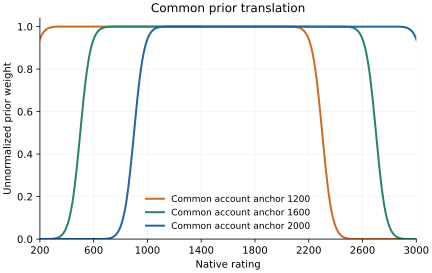
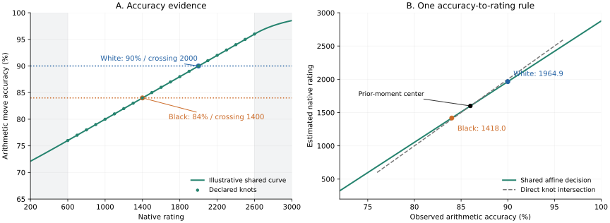
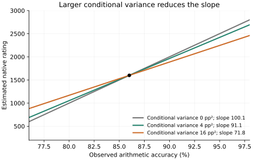

# Shared-Curve Affine Estimation of Single-Game Chess Strength

## Abstract

A player's average move accuracy depends on both playing strength and the positions reached in a game. A shared accuracy curve describes how rating-conditioned human move policies would perform at those positions. Direct inversion can be unstable when the curve is flat or observed accuracy exceeds its measured range. This paper derives a common affine decision rule combining the current game's curve and conditional move-choice variance with a broad prior centered on supplied account ratings. It is the minimum mean-square predictor among affine functions under the stated moment model. It preserves within-game accuracy ordering and needs no collection of other games or fitted population asset. The output is a point estimate, not a calibrated rating interval.

## 1. Inputs and shared measurement

Let $R$ denote single-game strength on Maia's native Lichess Blitz scale. Inputs are the current game's reached positions, engine-derived legal-move accuracies, rating-conditioned Maia policies, played moves, and optional account ratings. All game-dependent quantities come from this game alone. Other test games and external reference estimates never enter estimation, normalization, prior construction, or variance calculation.

For side $s\in\{W,B\}$ and decision $i$, let $q_{si}(m)\in[0,100]$ denote the engine-based accuracy of legal move $m$, and $p_{si,k}(m)$ its normalized Maia probability at rating $r_k=600+100k$, $k=0,\ldots,20$. Every legal move contributes with its probability. Positions with exactly one legal move are excluded; positions with one highly probable move remain included. The conditional moments are

$$
\mu_{si}(r_k)=\sum_m p_{si,k}(m)q_{si}(m),\qquad
u_{si}(r_k)=\sum_m p_{si,k}(m)q_{si}(m)^2-\mu_{si}(r_k)^2.
$$

With $n_s$ usable decisions and played move $a_{si}$, define

$$
A_s=\frac1{n_s}\sum_iq_{si}(a_{si}),\qquad
M_s(r_k)=\frac1{n_s}\sum_i\mu_{si}(r_k),\qquad
V_s(r_k)=\frac1{n_s^2}\sum_i u_{si}(r_k).
$$

Observed and expected accuracy are both arithmetic means. This differs from an aggregate game-accuracy statistic that adds volatility weighting or a harmonic-mean penalty. Matching the aggregation makes their comparison interpretable.

Average the two expected curves with equal side weights, then project the knots onto nondecreasing sequences:

$$
(c_0,\ldots,c_{20})=\underset{z_0\le\cdots\le z_{20}}{\arg\min}
\sum_{k=0}^{20}\left[z_k-\frac{M_W(r_k)+M_B(r_k)}2\right]^2.
$$

If only one side has usable decisions, it supplies the curve. A shape-preserving cubic Hermite interpolant defines $C(r)$ between 600 and 2600. For endpoint slopes $d_\ell,d_h\ge0$, extend it smoothly over the numerical support $[0,3200]$:

$$
C(r)=
\begin{cases}
c_0\exp[d_\ell(r-600)/c_0],&r<600,\\
\operatorname{PCHIP}(r;c_0,\ldots,c_{20}),&600\le r\le2600,\\
100-(100-c_{20})\exp[-d_h(r-2600)/(100-c_{20})],&r>2600.
\end{cases}
$$

Degenerate endpoints are interpreted by continuity. The curve stays within $[0,100]$; its tails add no measured human behavior outside Maia's anchors.

The shared conditional variance is

$$
v=\lambda^2\frac12\sum_{s\in\{W,B\}}
\frac1{21}\sum_{k=0}^{20}V_s(r_k),\qquad \lambda=1.
$$

With one available side, average over that side instead. In squared accuracy percentage points, $v$ describes averages of conditionally independent hypothetical Maia choices at fixed reached positions. It is **not** played-move sample variance, measured Maia prediction-error variance, or calibrated rating uncertainty. The factor $n_s^{-2}$ already accounts for averaging.

## 2. A common account-centered prior

Define $H(t)=t^4/[t^4+(1-t)^4]$ after clipping $t$ to $[0,1]$. The base prior has unnormalized weight

$$
w_0(r)=H\!\left(\frac{r-200}{600}\right)
H\!\left(\frac{3000-r}{600}\right).
$$

It is flat from 800 to 2400, vanishes at and beyond 200 and 3000, and has smooth fourth-power shoulders. Its center is 1600. These are declared assumptions, not learned population statistics or empirical limits on performance.

Convert supplied account ratings to native coordinates and clip them to $[0,3200]$. Let $a$ be their mean, using the sole available rating when necessary. Set $\delta=a-1600$; without supplied ratings, set $\delta=0$. Translate, truncate to fixed support, and normalize:

$$
\pi_a(r)=\frac{w_0(r-\delta)}{\int_0^{3200}w_0(t-\delta)\,dt},
\qquad 0\le r\le3200.
$$

Both players use this distribution. Truncation can move its mean away from the account anchor. Changing either account rating affects both estimates through the common prior; account influence is not a fixed percentage of the final result.

*Figure 1. Account anchors translate the same prior shape. Calculation normalizes each curve over fixed native support. Only the mean available account rating enters; a difference between the opponents' account ratings does not produce separate priors.*

## 3. Deriving the affine rule

Use the working moment model

$$
R\sim\pi_a,\qquad A=C(R)+\varepsilon,\qquad
\mathbb E[\varepsilon\mid R]=0,\quad
\operatorname{Var}(\varepsilon\mid R)=v.
$$

It specifies the moments needed for an affine predictor without requiring Gaussian noise. Write

$$
\mu_R=\mathbb E[R],\quad \mu_C=\mathbb E[C(R)],\quad
S_C^2=\operatorname{Var}[C(R)],\quad
K=\operatorname{Cov}[R,C(R)],
$$

where expectations use $\pi_a$. Minimizing $\mathbb E[(R-\alpha-\beta A)^2]$ gives $\alpha=\mu_R-\beta\mu_C$ and $\beta=K/(S_C^2+v)$. The decision is

$$
\boxed{\displaystyle
\widehat R_s=\operatorname{clip}_{[0,3200]}
\left[\mu_R+\frac{K}{S_C^2+v}(A_s-\mu_C)\right].}
$$

Mean-square optimality concerns the unbounded affine predictor under this moment model, not all nonlinear estimators. Clipping cannot increase squared error when the true value is inside the declared support. Numerical integrals use a grid spaced at most five native rating points. Native display rounds to the nearest integer, with half values rounded upward. No estimate is returned for an unobserved player or an entirely flat shared curve.

The rule starts at the prior's mean rating and applies one common rating-per-accuracy slope to each observed surplus or deficit. Increasing conditional variance with the curve and prior fixed reduces the slope and moves estimates toward $\mu_R$.

For an exactly linear curve $C(r)=c+br$, $b>0$, the unbounded rule simplifies to

$$
\widehat R_s=
\mu_R+\frac{b^2\operatorname{Var}(R)}{b^2\operatorname{Var}(R)+v}
\left[\frac{A_s-c}{b}-\mu_R\right].
$$

It is direct curve inversion with its displacement from the prior center reduced by a signal-to-total-variance ratio. Inversion is recovered at $v=0$. For nonlinear curves, even zero conditional variance leaves an affine approximation.

## 4. Independently specified numerical example

Declare synthetic knots $c_k=70+0.01r_k$, apply the interpolation and exponential tails above, set $v=4$ squared percentage points, supply native account ratings 1500 and 1700, and observe $A_W=90$, $A_B=84$. These inputs are illustrative, not measured Maia outputs or quantities derived from game data. The common anchor is 1600, so the prior is unshifted.

| Quantity | Value |
| --- | ---: |
| Prior normalizer | 2200 |
| Prior mean $\mu_R$ | 1600.0000 |
| Prior standard deviation | 638.2986 |
| Expected accuracy $\mu_C$ | 85.9964 |
| Curve accuracy variance $S_C^2$ | 40.6522 |
| Conditional variance $v$ | 4.0000 |
| Rating–accuracy covariance $K$ | 4069.6959 |
| Affine slope $\beta$ | 91.1420 rating points per accuracy point |

The tails explain the small departure of $\mu_C$ from 86. Direct intersections are 2000 for White and 1400 for Black. The affine calculation gives

$$
\widehat R_W=1600+91.1420(90-85.9964)\approx1964.9,
\qquad
\widehat R_B=1600+91.1420(84-85.9964)\approx1418.0.
$$

The displayed estimates are **1965 and 1418**. This demonstrates the calculation, not predictive validity.

*Figure 2. Direct intersections and affine estimates summarize the same observations differently. Shading marks extrapolation beyond the declared knots. The affine decision passes through the prior-moment center $(\mu_C,\mu_R)$.*

*Figure 3. Increasing only conditional variance reduces the slope; every line retains the same center. These are decision rules, not probability densities or confidence bands.*

## 5. Ordering and rating scales

Nondecreasing $C$ ensures $K\ge0$. For independent copies $R,R'$,

$$
K=\tfrac12\mathbb E[(R-R')\{C(R)-C(R')\}]\ge0.
$$

Thus the unbounded estimated difference is $\beta(A_W-A_B)$. Equal accuracies give equal estimates, and higher accuracy cannot give a lower estimate within the game. Zero slope, clipping, rounding, or a display-tie threshold can collapse strict differences into ties. No minimum gap is imposed. This ordering is a property of the common rule, not proof that it ranks underlying strengths correctly.

Estimation occurs in native Lichess Blitz coordinates. For a declared site and time-control scale with conversion $T$ to native coordinates, convert supplied ratings through $T$, fit in native coordinates, and display $T^{-1}(\widehat R_s)$. The source-scale curve is $C(T(x))$. Inverse-consistent monotone conversions preserve corresponding estimates when only the declared scale changes, up to conversion approximation, support limits, and rounding. Performing affine integration directly on a nonlinearly converted axis would instead define a different model.

## 6. Limitations

The shared curve is an expectation, not a ceiling: a player can exceed high-rating policy means by avoiding rare errors. The affine rule gives a finite answer outside the measured accuracy range, but does not distinguish exceptional strength from policy error or unusually easy decisions. Tail assumptions and prior shape remain influential.

Conditional variance omits trajectory dependence, correlated decisions, finite engine-search error, Maia misspecification, time pressure, and extrapolation uncertainty. Its averaging term can become small in a long game without eliminating these uncertainties. There is no calibrated posterior distribution or confidence interval for the final estimate.

Equal-side pooling can hide differences in the positions faced by each player, while arithmetic averaging gives every usable decision equal weight. The common prior discards the account-rating difference: pairs with identical mean account ratings, curves, variances, and observed accuracies receive identical estimates. This comparability assumption is particularly consequential for opponents with very different long-run ratings.

The output is an operational summary of current-game quality under explicit human-policy and prior assumptions. Independent evaluation must assess its usefulness and account sensitivity without turning evaluation games into estimator inputs or reusable fitting assets.
