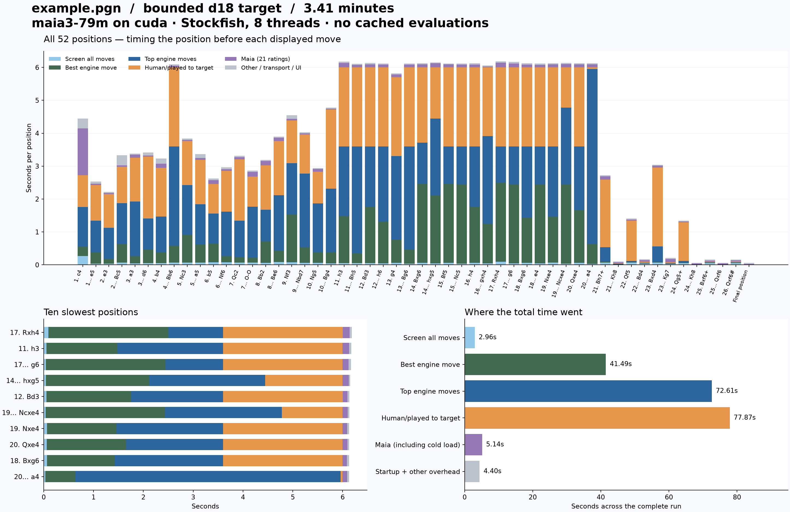

# Full example.pgn analysis profile

Complete uncached browser run: **204.477 seconds (3.41 minutes)**.

Started 2026-09-21T12:50:32.019322+00:00; finished 2026-09-21T12:53:56.495215+00:00.

Depth target 18, bounded search. Configuration: `{"game_id": "fd14a3a0d2634a269990bf8df72ac600", "target_depth": 18, "selected_model": "maia_kdd_1500", "total_positions": 52, "time_scale": 1.0, "position_budget_seconds": 6.0, "strategy": "bounded", "stockfish_threads": 8, "hash_mb": 512, "model": "maia3-79m", "device": "cuda", "torch": "2.14.0+cu130", "cuda_runtime": "13.0", "gpu": "NVIDIA GeForce RTX 4070 SUPER", "platform": "Windows-10-10.0.19045-SP0", "processor": "Intel64 Family 6 Model 165 Stepping 5, GenuineIntel"}`.

All 52 positions completed their search policy. Time-limited candidates retain their actual depths; the target is a ceiling, not a guarantee. Other legal moves retain shallower screening scores. Terminal positions require no Stockfish search. The FEN sequence was checked against the source PGN.

## Component totals

| Component | Seconds | Share of button-to-save time |
| --- | ---: | ---: |
| Screen all moves | 2.963 | 1.45% |
| Best engine move | 41.493 | 20.29% |
| Top engine moves | 72.611 | 35.51% |
| Human/played to target | 77.873 | 38.08% |
| Maia: all 21 ratings | 5.140 | 2.51% |
| Stockfish process startup | 0.249 | 0.12% |
| Other: transport, UI, adapters, save, profiling | 4.148 | 2.03% |

## Findings

- Stockfish search accounts for **95.34%** of total elapsed time. Maia, already using CUDA, accounts for 2.51%.
- The three slowest positions account for **9.06%** of total time; whole-game averages hide this concentration.
- The largest individual search is engine_top before **20... a4**: 5.322s measured versus 5.319s reported by Stockfish, 32,669,701 nodes, MultiPV 4, target depth 18, selective depth 57.
- The close agreement with native search time identifies engine work as the cause of that pause. A nominally shallow all-move screen can still be extremely expensive in a tactical position; nominal depth is not a wall-clock budget.
- This run uses both depth and time limits. Compare saved scores with the uncapped reference to assess the coverage tradeoff.
- A pool of independent Stockfish workers could improve whole-game throughput, but needs benchmarking with a fixed total CPU/thread budget. It would not by itself eliminate the slowest position's search cost. Eight native threads were already configured in this run.
- Eliminating all Maia work would save 2.51% of this run. Stockfish remains the dominant cost.

## Maia details

These timings are included in the Maia total above, not additional costs.

| Component | Total seconds |
| --- | ---: |
| model load | 1.069456 |
| prepare | 0.102178 |
| forward | 3.594436 |
| normalize transfer | 0.102954 |
| format | 0.183538 |
| validate | 0.077486 |
| queue | 0.000122 |

## Every position

Move labels identify the **next move to play**: the row is the cost of analyzing the position before that move. Maia values are milliseconds; other timing columns are seconds. Depth is the achieved main engine depth; played-move and per-search depths are in the CSVs.

| Move to play | Depth | Target met | Total s | Maia ms | Screen s | Best s | Human mid s | Engine top s | Human final s | Other s |
| --- | ---: | --- | ---: | ---: | ---: | ---: | ---: | ---: | ---: | ---: |
| 1. c4 | 18 | True | 4.450 | 1425.1 | 0.269 | 0.283 | 0.000 | 1.208 | 0.961 | 0.304 |
| 1... e5 | 18 | True | 2.529 | 40.3 | 0.036 | 0.351 | 0.000 | 0.959 | 1.077 | 0.065 |
| 2. e3 | 18 | True | 2.217 | 33.6 | 0.035 | 0.142 | 0.000 | 0.949 | 1.022 | 0.035 |
| 2... Bc5 | 18 | True | 3.328 | 41.6 | 0.066 | 0.563 | 0.000 | 1.244 | 1.112 | 0.301 |
| 3. a3 | 18 | True | 3.378 | 94.6 | 0.048 | 0.222 | 0.000 | 1.654 | 1.331 | 0.028 |
| 3... d6 | 18 | True | 3.412 | 33.2 | 0.051 | 0.410 | 0.000 | 0.950 | 1.877 | 0.091 |
| 4. b4 | 18 | True | 3.231 | 124.7 | 0.057 | 0.323 | 0.000 | 1.090 | 1.475 | 0.161 |
| 4... Bb6 | 18 | False | 6.096 | 50.1 | 0.069 | 0.505 | 0.000 | 3.027 | 2.401 | 0.045 |
| 5. Nc3 | 18 | True | 3.839 | 37.0 | 0.069 | 0.851 | 0.000 | 1.504 | 1.337 | 0.041 |
| 5... a5 | 18 | True | 3.368 | 51.8 | 0.070 | 0.537 | 0.000 | 1.234 | 1.351 | 0.123 |
| 6. b5 | 18 | True | 2.622 | 113.0 | 0.076 | 0.578 | 0.000 | 0.903 | 0.902 | 0.051 |
| 6... Nf6 | 18 | True | 2.962 | 49.8 | 0.075 | 0.183 | 0.000 | 1.362 | 1.233 | 0.059 |
| 7. Qc2 | 18 | False | 3.311 | 65.0 | 0.072 | 0.160 | 0.000 | 1.109 | 1.864 | 0.042 |
| 7... O-O | 18 | True | 2.867 | 143.7 | 0.066 | 0.150 | 0.000 | 1.549 | 0.914 | 0.045 |
| 8. Bb2 | 18 | True | 3.192 | 124.9 | 0.063 | 0.659 | 0.000 | 0.952 | 1.355 | 0.039 |
| 8... Be6 | 18 | True | 3.900 | 103.0 | 0.086 | 0.351 | 0.000 | 1.679 | 1.648 | 0.033 |
| 9. Nf3 | 18 | True | 4.543 | 47.3 | 0.080 | 1.456 | 0.000 | 1.551 | 1.304 | 0.104 |
| 9... Nbd7 | 18 | True | 4.027 | 33.3 | 0.058 | 0.473 | 0.000 | 2.242 | 1.194 | 0.026 |
| 10. Ng5 | 18 | True | 2.942 | 80.2 | 0.063 | 0.327 | 0.000 | 1.481 | 0.963 | 0.029 |
| 10... Bg4 | 18 | False | 4.778 | 27.8 | 0.049 | 0.326 | 0.000 | 1.942 | 2.400 | 0.033 |
| 11. h3 | 18 | False | 6.173 | 132.7 | 0.053 | 1.428 | 0.000 | 2.118 | 2.400 | 0.042 |
| 11... Bh5 | 18 | False | 6.111 | 80.4 | 0.049 | 0.295 | 0.000 | 3.256 | 2.401 | 0.031 |
| 12. Bd3 | 18 | False | 6.135 | 97.2 | 0.056 | 1.701 | 0.000 | 1.843 | 2.400 | 0.037 |
| 12... h6 | 18 | False | 6.118 | 84.4 | 0.047 | 1.260 | 0.000 | 2.292 | 2.401 | 0.034 |
| 13. g4 | 18 | False | 5.823 | 83.1 | 0.062 | 0.700 | 0.000 | 2.544 | 2.399 | 0.035 |
| 13... Bg6 | 18 | False | 6.116 | 84.2 | 0.040 | 0.422 | 0.000 | 3.138 | 2.399 | 0.032 |
| 14. Bxg6 | 16 | False | 6.125 | 92.0 | 0.060 | 2.401 | 0.000 | 1.257 | 2.282 | 0.033 |
| 14... hxg5 | 18 | False | 6.151 | 124.6 | 0.044 | 2.072 | 0.000 | 2.329 | 1.554 | 0.027 |
| 15. Bf5 | 17 | False | 6.123 | 93.6 | 0.063 | 2.401 | 0.000 | 1.137 | 2.399 | 0.030 |
| 15... Nc5 | 16 | False | 6.116 | 86.3 | 0.037 | 2.401 | 0.000 | 1.161 | 2.401 | 0.030 |
| 16. h4 | 18 | False | 6.124 | 86.1 | 0.062 | 1.705 | 0.000 | 1.833 | 2.401 | 0.037 |
| 16... gxh4 | 18 | False | 6.058 | 29.1 | 0.043 | 1.202 | 0.000 | 2.672 | 2.083 | 0.029 |
| 17. Rxh4 | 14 | False | 6.183 | 140.3 | 0.093 | 2.402 | 0.000 | 1.106 | 2.400 | 0.042 |
| 17... g6 | 15 | False | 6.165 | 118.6 | 0.045 | 2.402 | 0.000 | 1.151 | 2.401 | 0.048 |
| 18. Bxg6 | 18 | False | 6.130 | 87.2 | 0.065 | 1.361 | 0.000 | 2.174 | 2.400 | 0.043 |
| 18... e4 | 12 | False | 6.119 | 78.4 | 0.044 | 2.401 | 0.000 | 1.155 | 2.401 | 0.040 |
| 19. Nxe4 | 18 | False | 6.131 | 90.5 | 0.066 | 1.392 | 0.000 | 2.143 | 2.400 | 0.041 |
| 19... Ncxe4 | 15 | False | 6.134 | 104.4 | 0.039 | 2.401 | 0.000 | 2.338 | 1.221 | 0.031 |
| 20. Qxe4 | 18 | False | 6.130 | 95.3 | 0.058 | 1.597 | 0.000 | 1.944 | 2.399 | 0.037 |
| 20... a4 | 18 | False | 6.128 | 94.2 | 0.031 | 0.603 | 0.000 | 5.322 | 0.043 | 0.035 |
| 21. Bh7+ | 18 | True | 2.724 | 100.4 | 0.072 | 0.019 | 0.000 | 0.440 | 2.058 | 0.033 |
| 21... Kh8 | 18 | True | 0.102 | 26.0 | 0.007 | 0.011 | 0.000 | 0.016 | 0.015 | 0.028 |
| 22. Qf5 | 18 | True | 1.409 | 30.5 | 0.066 | 0.009 | 0.000 | 0.042 | 1.225 | 0.037 |
| 22... Bd4 | 18 | True | 0.168 | 47.8 | 0.034 | 0.009 | 0.000 | 0.021 | 0.029 | 0.027 |
| 23. Bxd4 | 18 | False | 3.044 | 54.2 | 0.073 | 0.007 | 0.000 | 0.477 | 2.401 | 0.032 |
| 23... Kg7 | 18 | True | 0.209 | 99.8 | 0.026 | 0.009 | 0.000 | 0.019 | 0.020 | 0.035 |
| 24. Qg5+ | 18 | True | 1.339 | 28.2 | 0.057 | 0.007 | 0.000 | 0.051 | 1.177 | 0.018 |
| 24... Kh8 | 18 | True | 0.058 | 25.1 | 0.004 | 0.007 | 0.000 | 0.006 | 0.000 | 0.016 |
| 25. Bxf6+ | 18 | True | 0.158 | 37.5 | 0.057 | 0.006 | 0.000 | 0.013 | 0.018 | 0.026 |
| 25... Qxf6 | 18 | True | 0.057 | 25.8 | 0.003 | 0.006 | 0.000 | 0.006 | 0.000 | 0.016 |
| 26. Qxf6# | 18 | True | 0.163 | 37.7 | 0.054 | 0.006 | 0.000 | 0.019 | 0.021 | 0.025 |
| Final position | 18 | True | 0.061 | 23.9 | 0.000 | 0.000 | 0.000 | 0.000 | 0.000 | 0.037 |

## Slowest individual native searches

| Position before | Stage | Candidate | Played? | Seconds | Nodes (million) |
| --- | --- | --- | --- | ---: | ---: |
| 20... a4 | engine_top | MultiPV |  | 5.322 | 32.67 |
| 11... Bh5 | engine_top | MultiPV |  | 3.256 | 12.35 |
| 13... Bg6 | engine_top | MultiPV |  | 3.138 | 10.99 |
| 4... Bb6 | engine_top | MultiPV |  | 3.027 | 6.99 |
| 16... gxh4 | engine_top | MultiPV |  | 2.672 | 9.26 |
| 13. g4 | engine_top | MultiPV |  | 2.544 | 10.99 |
| 17. Rxh4 | engine_best | MultiPV |  | 2.402 | 8.23 |
| 17... g6 | engine_best | MultiPV |  | 2.402 | 8.76 |
| 15. Bf5 | engine_best | MultiPV |  | 2.401 | 8.40 |
| 15... Nc5 | engine_best | MultiPV |  | 2.401 | 8.33 |
| 18... e4 | engine_best | MultiPV |  | 2.401 | 8.95 |
| 19... Ncxe4 | engine_best | MultiPV |  | 2.401 | 9.08 |
| 14. Bxg6 | engine_best | MultiPV |  | 2.401 | 7.74 |
| 19... Ncxe4 | engine_top | MultiPV |  | 2.338 | 9.03 |
| 14... hxg5 | engine_top | MultiPV |  | 2.329 | 9.38 |

## Timing boundaries and limitations

- The total is measured in the browser from Start Analysis until the final study save finishes, including profiling setup and the per-position logging calls. Import, page loading, and report generation are excluded.
- Maia timing separates the initial model load, preparation, GPU forward pass, normalization/output transfer, and Python result formatting. CUDA is synchronized at profiling boundaries; this adds some instrumentation overhead.
- Stockfish phase timings measure the actual native search stream, including Python handling and any response backpressure. Native-reported search time, nodes, peak NPS, selective depth, and hash occupancy are also available in searches.csv.
- Browser HTTP timings and tree-update timings in positions.csv overlap with engine time. Do not add them to the component totals. Render/network/serialization time is reported as combined residual overhead, not falsely attributed to a single component.
- Final save: 0.088s. Time outside the per-position intervals: 1.700s (includes save, profile-start, and profiling round trips).
- Caches were cleared before the run, automatic interactive searches were disabled, and Stockfish retained its usual hash across positions and stages. Per-position search budget: 6.0s.
- This is one complete run on a live desktop, not a statistical benchmark. Stockfish multithreaded searches and timing vary between runs.
- Source SHA-256: `84b94e8740483ba494a71af962f60ab1dd59cce41262ba6d7812373879602657`.

Downloads: [per-position CSV](positions.csv), [every native search CSV](searches.csv), [full raw profile](profile.json), [summary JSON](summary.json), [vector chart](timings.svg).
