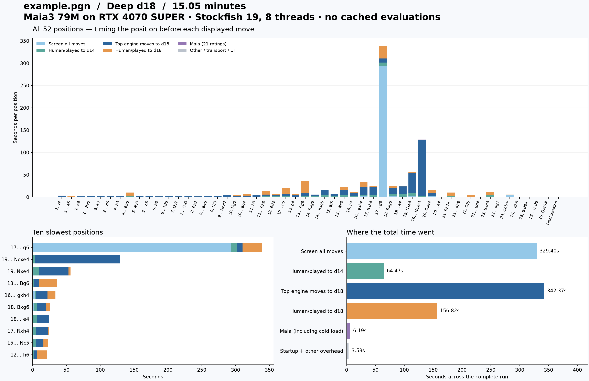

# Full example.pgn analysis profile

Complete uncached browser run: **902.775 seconds (15.05 minutes)**.

Started 2026-09-21T10:43:55.552427+00:00; finished 2026-09-21T10:58:58.327027+00:00.

Depth 18, staged search; Maia3 79M on RTX 4070 SUPER, all 21 ratings, Maia 1500 candidate selection; Stockfish 19, 8 CPU threads, 512 MB hash.

All 52 positions were evaluated once without cached results. Every selected candidate and played move reached d18. Other legal moves retain shallower scores from screening (d10 or higher); this is the default staged analysis. The final checkmate requires no Stockfish search. The FEN sequence was checked against the source PGN.

## Component totals

| Component | Seconds | Share of button-to-save time |
| --- | ---: | ---: |
| Screen all moves | 329.398 | 36.49% |
| Human/played to d14 | 64.468 | 7.14% |
| Top engine moves to d18 | 342.368 | 37.92% |
| Human/played to d18 | 156.824 | 17.37% |
| Maia: all 21 ratings | 6.192 | 0.69% |
| Stockfish process startup | 0.246 | 0.03% |
| Other: transport, UI, adapters, save, profiling | 3.280 | 0.36% |

## Findings

- Stockfish search accounts for **98.92%** of total elapsed time. Maia, already using CUDA, accounts for 0.69%.
- The three slowest positions account for **58.07%** of total time; whole-game averages hide this concentration.
- The largest individual search is screening before **17... g6**: 293.611s measured versus 293.601s reported by Stockfish, 1,067,912,515 nodes, MultiPV 31, target depth 10, selective depth 70.
- The close agreement with native search time identifies engine work as the cause of that pause. A nominally shallow all-move screen can still be extremely expensive in a tactical position; nominal depth is not a wall-clock budget.
- The next optimization to test is limiting the all-move screening effort while retaining deeper searches for selected candidates. This changes screening coverage and requires explicit handling of partial depths; no search limit was imposed in this measured run.
- A pool of independent Stockfish workers could improve whole-game throughput, but needs benchmarking with a fixed total CPU/thread budget. It would not by itself eliminate the slowest position's search cost. Eight native threads were already configured in this run.
- Even eliminating all Maia work would save less than 1% of this run. GPU tuning and front-end rendering are therefore low-priority targets for this game's measured bottleneck.

## Maia details

These timings are included in the Maia total above, not additional costs.

| Component | Total seconds |
| --- | ---: |
| model load | 0.886782 |
| prepare | 0.087082 |
| forward | 4.888809 |
| normalize transfer | 0.086604 |
| format | 0.168461 |
| validate | 0.065073 |
| queue | 0.000102 |

## Every position

Move labels identify the **next move to play**: the row is the cost of analyzing the position before that move. Maia values are milliseconds; other timing columns are seconds. Final position is after 26.Qxf6#.

| Move to play | Total s | Maia ms | Screen s | Human d14 s | Engine top d18 s | Human d18 s | Other s |
| --- | ---: | ---: | ---: | ---: | ---: | ---: | ---: |
| 1. c4 | 3.430 | 1178.6 | 0.554 | 0.210 | 1.191 | 0.000 | 0.297 |
| 1... e5 | 1.406 | 30.5 | 0.260 | 0.202 | 0.739 | 0.155 | 0.020 |
| 2. e3 | 1.442 | 27.9 | 0.254 | 0.152 | 0.982 | 0.000 | 0.027 |
| 2... Bc5 | 2.706 | 28.9 | 0.363 | 0.231 | 1.177 | 0.879 | 0.027 |
| 3. a3 | 2.329 | 76.6 | 0.450 | 0.194 | 1.453 | 0.122 | 0.032 |
| 3... d6 | 2.589 | 30.0 | 0.487 | 0.263 | 0.981 | 0.796 | 0.032 |
| 4. b4 | 1.984 | 226.1 | 0.409 | 0.201 | 1.120 | 0.000 | 0.027 |
| 4... Bb6 | 10.408 | 51.4 | 0.227 | 1.325 | 1.678 | 7.097 | 0.031 |
| 5. Nc3 | 2.909 | 141.8 | 0.398 | 0.417 | 1.208 | 0.715 | 0.029 |
| 5... a5 | 2.092 | 35.6 | 0.403 | 0.295 | 1.173 | 0.161 | 0.024 |
| 6. b5 | 2.023 | 55.9 | 0.593 | 0.186 | 0.815 | 0.343 | 0.030 |
| 6... Nf6 | 2.121 | 96.0 | 0.513 | 0.212 | 1.204 | 0.078 | 0.017 |
| 7. Qc2 | 2.063 | 28.3 | 0.353 | 0.311 | 0.862 | 0.480 | 0.027 |
| 7... O-O | 2.293 | 48.8 | 0.554 | 0.180 | 1.307 | 0.169 | 0.033 |
| 8. Bb2 | 1.918 | 94.1 | 0.400 | 0.211 | 0.943 | 0.243 | 0.028 |
| 8... Be6 | 2.966 | 27.7 | 0.469 | 0.215 | 1.320 | 0.904 | 0.030 |
| 9. Nf3 | 3.063 | 261.3 | 0.601 | 0.330 | 1.294 | 0.544 | 0.032 |
| 9... Nbd7 | 4.629 | 85.9 | 0.415 | 0.345 | 3.361 | 0.390 | 0.032 |
| 10. Ng5 | 3.928 | 193.2 | 0.557 | 0.299 | 2.249 | 0.602 | 0.028 |
| 10... Bg4 | 7.327 | 224.6 | 0.554 | 0.643 | 2.346 | 3.525 | 0.034 |
| 11. h3 | 5.295 | 103.4 | 0.727 | 0.422 | 3.514 | 0.498 | 0.030 |
| 11... Bh5 | 13.101 | 86.4 | 0.281 | 1.268 | 4.307 | 7.129 | 0.029 |
| 12. Bd3 | 6.029 | 130.0 | 0.740 | 0.768 | 2.733 | 1.629 | 0.029 |
| 12... h6 | 20.833 | 99.7 | 0.540 | 0.892 | 5.346 | 13.918 | 0.037 |
| 13. g4 | 7.616 | 115.7 | 0.448 | 0.776 | 3.812 | 2.432 | 0.032 |
| 13... Bg6 | 36.560 | 90.6 | 0.959 | 1.630 | 6.358 | 27.494 | 0.028 |
| 14. Bxg6 | 5.723 | 148.8 | 0.468 | 1.999 | 3.064 | 0.000 | 0.043 |
| 14... hxg5 | 16.334 | 81.8 | 1.142 | 2.438 | 12.504 | 0.136 | 0.032 |
| 15. Bf5 | 6.628 | 143.4 | 0.915 | 1.355 | 4.183 | 0.000 | 0.031 |
| 15... Nc5 | 22.823 | 86.4 | 0.595 | 3.839 | 11.716 | 6.556 | 0.030 |
| 16. h4 | 10.796 | 163.8 | 0.713 | 1.511 | 6.774 | 1.603 | 0.032 |
| 16... gxh4 | 33.920 | 126.0 | 3.198 | 1.985 | 16.981 | 11.596 | 0.033 |
| 17. Rxh4 | 24.825 | 81.7 | 1.209 | 4.044 | 18.031 | 1.427 | 0.032 |
| 17... g6 | 339.287 | 104.5 | 293.611 | 8.020 | 8.861 | 28.653 | 0.037 |
| 18. Bxg6 | 25.945 | 154.1 | 1.877 | 4.561 | 13.725 | 5.597 | 0.031 |
| 18... e4 | 24.864 | 121.2 | 0.609 | 5.493 | 17.705 | 0.907 | 0.029 |
| 19. Nxe4 | 56.145 | 125.6 | 1.360 | 8.159 | 43.477 | 2.991 | 0.032 |
| 19... Ncxe4 | 128.769 | 153.1 | 0.478 | 3.089 | 125.014 | 0.015 | 0.020 |
| 20. Qxe4 | 15.808 | 169.8 | 1.902 | 1.589 | 5.704 | 6.410 | 0.032 |
| 20... a4 | 0.570 | 169.9 | 0.079 | 0.042 | 0.231 | 0.028 | 0.021 |
| 21. Bh7+ | 10.080 | 67.1 | 1.164 | 0.798 | 0.238 | 7.781 | 0.031 |
| 21... Kh8 | 0.247 | 187.1 | 0.010 | 0.017 | 0.017 | 0.000 | 0.016 |
| 22. Qf5 | 5.344 | 47.1 | 0.604 | 0.062 | 0.034 | 4.577 | 0.020 |
| 22... Bd4 | 0.241 | 86.6 | 0.047 | 0.029 | 0.020 | 0.026 | 0.033 |
| 23. Bxd4 | 11.804 | 48.1 | 1.180 | 2.795 | 0.526 | 7.223 | 0.032 |
| 23... Kg7 | 0.248 | 123.2 | 0.035 | 0.024 | 0.019 | 0.020 | 0.026 |
| 24. Qg5+ | 5.612 | 29.1 | 4.191 | 0.387 | 0.030 | 0.948 | 0.027 |
| 24... Kh8 | 0.127 | 95.8 | 0.004 | 0.005 | 0.005 | 0.000 | 0.016 |
| 25. Bxf6+ | 0.816 | 30.0 | 0.704 | 0.019 | 0.014 | 0.012 | 0.038 |
| 25... Qxf6 | 0.067 | 28.0 | 0.005 | 0.005 | 0.007 | 0.000 | 0.023 |
| 26. Qxf6# | 0.898 | 27.5 | 0.791 | 0.020 | 0.015 | 0.012 | 0.032 |
| Final position | 0.059 | 22.9 | 0.000 | 0.000 | 0.000 | 0.000 | 0.037 |

## Slowest individual native searches

| Position before | Stage | Candidate | Played? | Seconds | Nodes (million) |
| --- | --- | --- | --- | ---: | ---: |
| 17... g6 | screening | MultiPV |  | 293.611 | 1067.91 |
| 19... Ncxe4 | engine_top | MultiPV |  | 125.014 | 597.83 |
| 19. Nxe4 | engine_top | MultiPV |  | 43.477 | 178.44 |
| 13... Bg6 | human_final | Nxg4 |  | 23.478 | 80.57 |
| 17... g6 | human_final | Nfe4 |  | 23.273 | 77.89 |
| 17. Rxh4 | engine_top | MultiPV |  | 18.031 | 68.12 |
| 18... e4 | engine_top | MultiPV |  | 17.705 | 65.72 |
| 16... gxh4 | engine_top | MultiPV |  | 16.981 | 64.60 |
| 18. Bxg6 | engine_top | MultiPV |  | 13.725 | 52.50 |
| 14... hxg5 | engine_top | MultiPV |  | 12.504 | 44.07 |
| 15... Nc5 | engine_top | MultiPV |  | 11.716 | 45.26 |
| 17... g6 | engine_top | MultiPV |  | 8.861 | 32.49 |
| 12... h6 | human_final | Nc5 |  | 7.318 | 22.75 |
| 11... Bh5 | human_final | Bf5 |  | 7.129 | 24.66 |
| 21. Bh7+ | human_final | Bxf7+ |  | 7.057 | 28.79 |

## Timing boundaries and limitations

- The total is measured in the browser from Start Analysis until the final study save finishes, including profiling setup and the per-position logging calls. Import, page loading, and report generation are excluded.
- Maia timing separates the initial model load, preparation, GPU forward pass, normalization/output transfer, and Python result formatting. CUDA is synchronized at profiling boundaries; this adds some instrumentation overhead.
- Stockfish phase timings measure the actual native search stream, including Python handling and any response backpressure. Native-reported search time, nodes, peak NPS, selective depth, and hash occupancy are also available in searches.csv.
- Browser HTTP timings and tree-update timings in positions.csv overlap with engine time. Do not add them to the component totals. Render/network/serialization time is reported as combined residual overhead, not falsely attributed to a single component.
- Final save: 0.081s. Time outside the per-position intervals: 1.736s (includes save, profile-start, and profiling round trips).
- Caches were cleared before the run, automatic interactive searches were disabled, and the model/engine started cold. Stockfish retained its usual hash across positions and stages. No node, time, or per-position timeout was imposed.
- This is one complete run on a live desktop, not a statistical benchmark. Stockfish multithreaded searches and timing vary between runs.
- Source SHA-256: `84b94e8740483ba494a71af962f60ab1dd59cce41262ba6d7812373879602657`.

Downloads: [per-position CSV](positions.csv), [every native search CSV](searches.csv), [full raw profile](profile.json), [summary JSON](summary.json), [vector chart](timings.svg).
